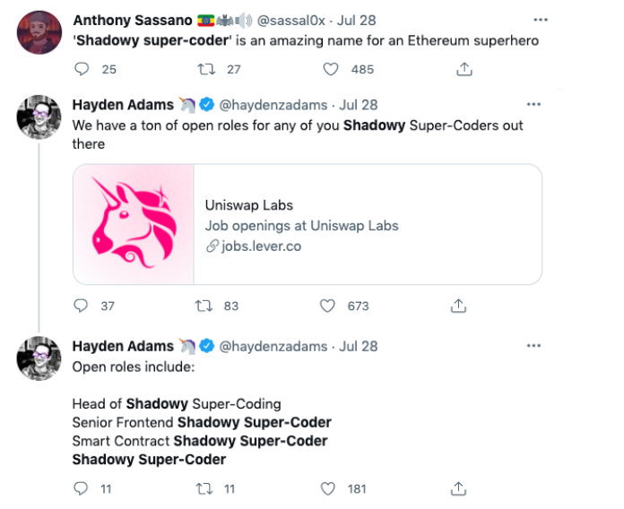

# Shadowy Super Coder Proposal
## Background
A couple of days ago, U.S. Senator Elizabeth Warren expressed that _**"Crypto Puts Financial System in the Hands of 
'Shadowy Super-Coders'"**_. 
Check out the full story [here](https://decrypt.co/76997/elizabeth-warren-crypto-big-banks-shadowy-super-coders). 
This quickly turned into a trending meme on CT:

While crypto skeptics make criticisms, we want to give tributes to all Shadowy Super-Coder out there who contributed to
the blockchain ecosystem!

## Snapshot
This repo contains queries run on [ethereum public dataset on google bigquery](https://bigquery.cloud.google.com/dataset/bigquery-public-data:crypto_ethereum)
which are used for the NFT and perk drop.

## NFTs

